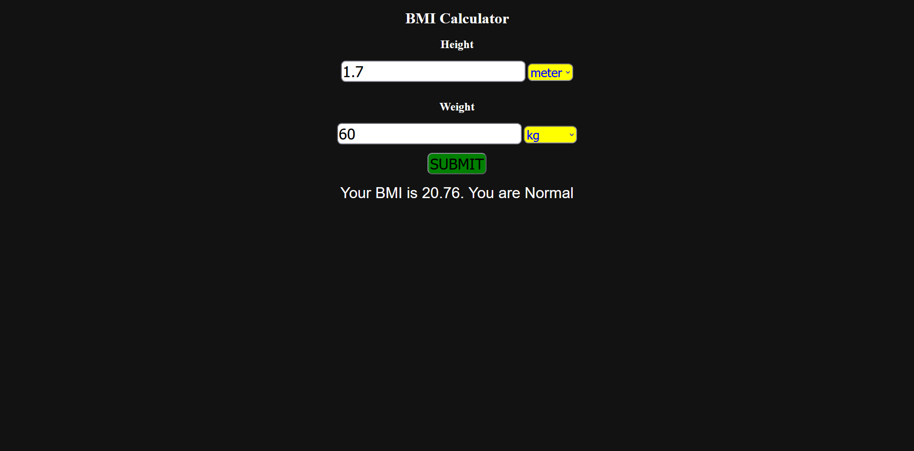
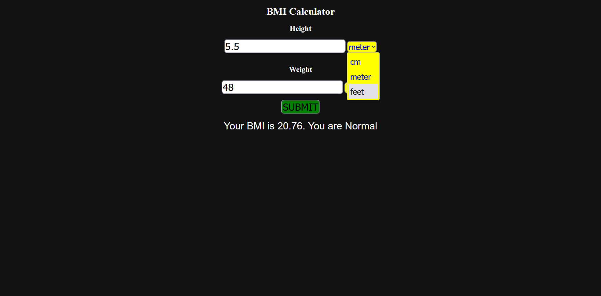

# BMI calculator with HTML, CSS and JavaScript.

## Speciality
- You can use different units of measurement

## How to install 
```bash
git clone https://github.com/PhaijooBaibhaav/BMI-calculator-html.git

cd BMI-calculator-html

index.html
```

## Some screenshots






### Made by *Baibhav Phaijoo*.
